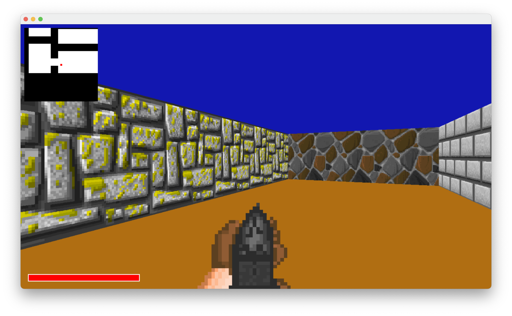
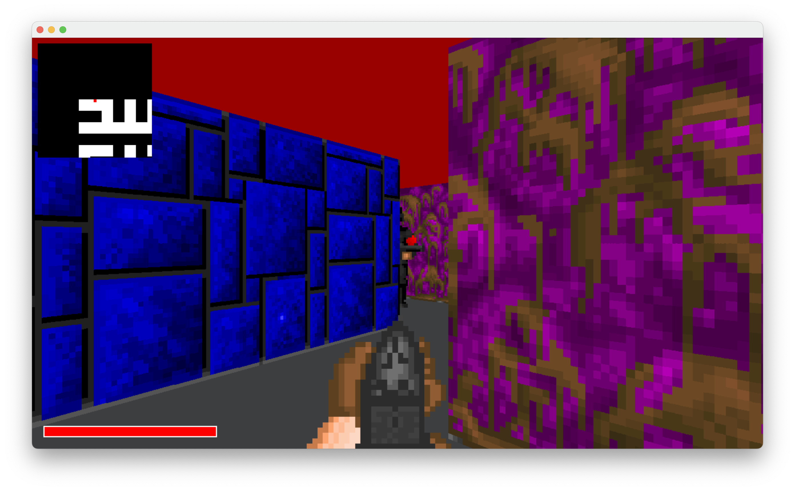

Cub3d
=====

The Cub3d project is a first-person shooter game that utilizes raycasting techniques, inspired from the iconic game [Wolfenstein 3D](https://en.wikipedia.org/wiki/Wolfenstein_3D). It serves as the second graphic project at 42.

In the mandatory part of this project, the objective is to read a file passed as an argument, extract the map and textures from it, and utilize this data to create a graphical representation from a first-person perspective.

To get more information about the subject please refer to [Subject.pdf](Subject.pdf)

The bonus part of the project introduces additional features such as wall collisions, a minimap, doors, animated sprites, and mouse handling.

I wanted a game that was a minimum playable so i also added a HUD to display the player's health and gun, as well as enemies that can be shot. The objective of the game is to eliminate all the enemies. If the player's health reaches zero, it's game over.

Support
------

| Platform | Supported | Graphic API     |
|----------|-----------|-----------------|
| Windows  | YES       | OpenGL          |
| Linux    | YES       | OpenGL          |
| MacOS    | YES       | Metal or OpenGL |

Build
-----

The repository must be cloned instead of downloading it as a zip file in order to resolve the submodules when configuring the project with CMake. Recursive cloning is not required as everything is managed through CMake.

The project can be built using CMake. Building in release if recomended for better performance.

```sh
mkdir build
cmake -S . -B build -DCMAKE_BUILD_TYPE=Release
cmake --build build --config Release
```

| CMake Options     | Values   | Description                                            |
|-------------------|----------|--------------------------------------------------------|
| `CUB_FORCE_OPENGL`| ON / OFF | Use OpenGL even if metal is available (only for MacOS) |

Usage
-----

Run the program with the desired map as the first argument.

```sh
./build/cub3d resources/maps/easy.cub
```

Keys:

- `ESC`: Exit the program
- `W` `A` `S` `D` : Move the player
- `Left click` : shoot
- `F` : open / close doors
- `Mouse` or `Arrows` : Rotate the view
- `Alt` or `option` : allow mouse to exit the window

Examples
--------





Libraries
---------

Cub3d uses one library called MiniLibX, provided by 42. It allows for basic keyboard and mouse input, opening windows, and simple drawing capabilities.  
To draw inside the window, MiniLibX provides a way to create pixel buffers. The user can then set pixel colors inside the buffers and draw the buffers on the window.

This branch uses my own implementation of MiniLibX in order to compile for Windows, Linux, and macOS.

- [Original MiniLibX for Linux](https://github.com/42Paris/minilibx-linux)
- [My cross-platform implementation of MiniLibX](https://github.com/Thomas-Chqt/MinilibX)

Learning
--------

Cub3D has been my favorite project so far and built on the skills I developed during [FdF](https://github.com/Thomas-Chqt/FdF). It was the project that really made me passionate about graphics and game programming. Working on it helped me understand how games work at a deeper level and gave me the chance to learn a lot about performance, algorithms, and creative problem-solving. It pushed me to tackle new challenges and become more confident in my abilities as a programmer.

**Technical Challenges**

One of the key challenges I faced during this project was adhering to strict coding norms imposed by the school. Each function had to be limited to 25 lines, and no more than 5 variables could be used per function.  
While implementing raycasting itself was straightforward thanks to comprehensive resources, meeting these constraints required creative solutions. I found myself using techniques to minimize the number of variables and splitting functions in ways I would not typically do in a real-world project.  
Although these constraints sometimes resulted in less-than-optimal code, they forced me to think critically about function design and code structure, giving me insight into code efficiency under strict guidelines.
An other unique challenges I faced in cub3D was handling time without using any time calculation functions, as per the project’s requirements. Instead, I had to manage animations and enemy cooldowns using frame counts, assuming the game would run at 60 FPS. This approach worked, but it introduced a limitation: if the game didn’t run at exactly 60 FPS, all animations and cooldowns would become slower. I included a #define to adjust the expected FPS, but this requires recompiling the game when changed, making it less flexible for different hardware setups.

**Performance Optimizations**

Beyond the DDA algorithm that is the standard for raycasting, I took additional steps to optimize the game’s performance. One key improvement was removing the screen-clearing operation that was used in previous projects. Since the walls are drawn to cover every pixel, clearing the screen was redundant. Removing this operation significantly reduced memory usage and improved performance, as benchmarking showed that writing large amounts of data to memory every frame was a costly operation. This taught me the importance of minimizing unnecessary computations, especially in graphics-heavy applications.

**Collision Handling**

Given that cub3D is not a fully 3D engine, collision detection and physics were relatively straightforward. When moving the player, I only needed to check whether the new position would place them inside a wall tile or outside the map boundary. If so, I change the moving step to be the distance between the player and the fisrt wall, resulting in the player hiting the wall.  
This simple yet effective approach was enhanced by separating the movement checks for the X and Y coordinates, creating a natural sliding effect.  
Additionally, interactions such as opening doors were handled by checking the tile at the position `player_pos` + `player_dir` and determining if it was a door. if it is, opening or closing it.

**Shooting Mechanics**

For shooting mechanics, I applied the same raycasting algorithm used to draw walls. By casting rays from the player’s position in the direction they were facing, I could determine if an enemy was hit when the ray entered a tile containing an enemy. This streamlined approach allowed me to avoid additional complex calculations and efficiently reuse existing logic. It also deepened my understanding of how raycasting can be applied beyond simple environment rendering to manage interactions with dynamic objects like enemies.

**Mathematical Concepts and New Algorithms**

This project also introduced me to several new algorithms and mathematical techniques. While I had previously implemented the Bresenham line algorithm, I revisited and refined it for this project to ensure better accuracy. More notably, I had to learn and apply the DDA algorithm, which was a new challenge that required significant research and experimentation. Additionally, I frequently used linear interpolation to scale textures dynamically based on the wall’s orientation and distance, which was crucial for achieving a visually consistent experience. These mathematical concepts greatly expanded my knowledge and gave me hands-on experience with real-time rendering techniques.

References
----------

The best ressource that i found about raycasting was the Raycasting tutorials by Lode Vandevenne on lodev.org.  
All the tutorials can be found on [lodev.org/cgtutor](https://lodev.org/cgtutor/) in the Raycasting section, but i mostly only used the [first](https://lodev.org/cgtutor/raycasting.html) and [third](https://lodev.org/cgtutor/raycasting3.html) tutorials.  

About the DDA algorithm i mostly used the video [Super Fast Ray Casting in Tiled Worlds using DDA](https://www.youtube.com/watch?v=NbSee-XM7WA) by javidx9